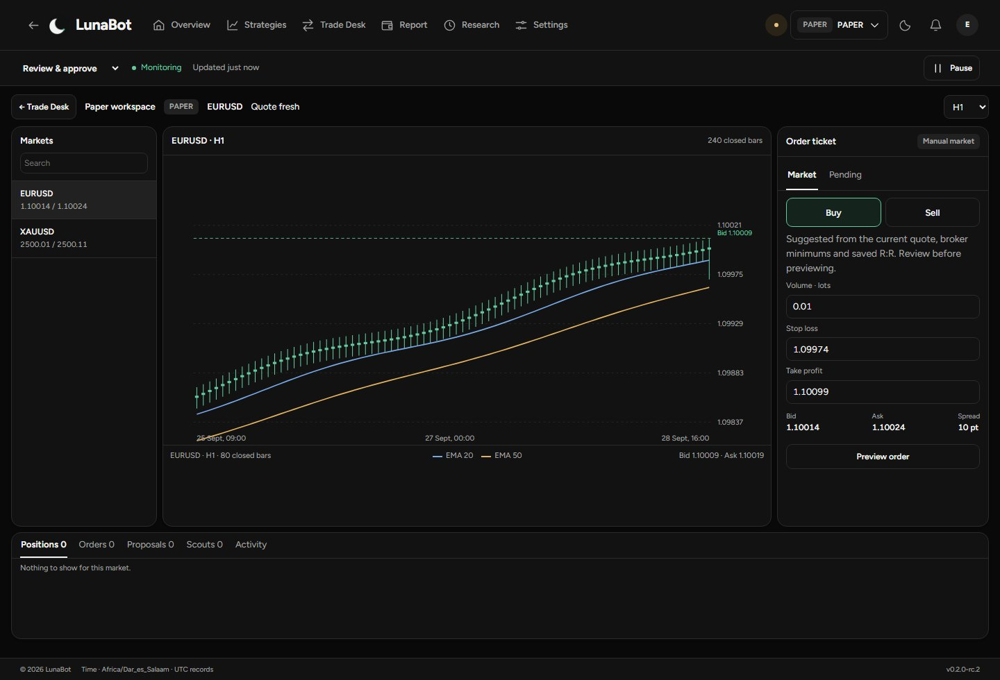
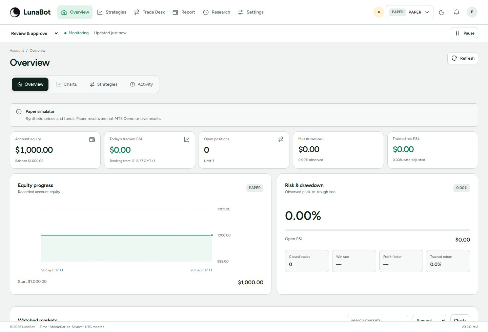
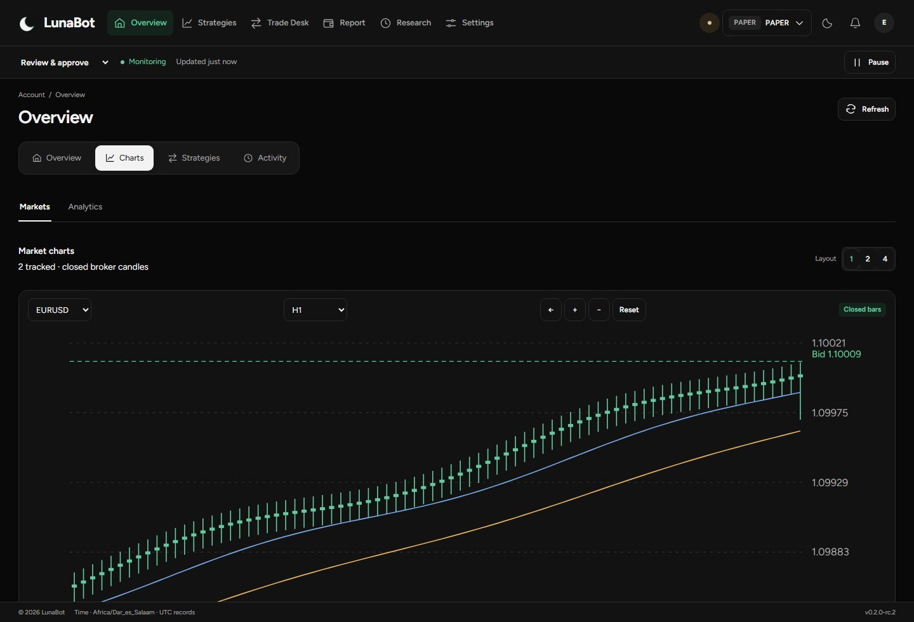
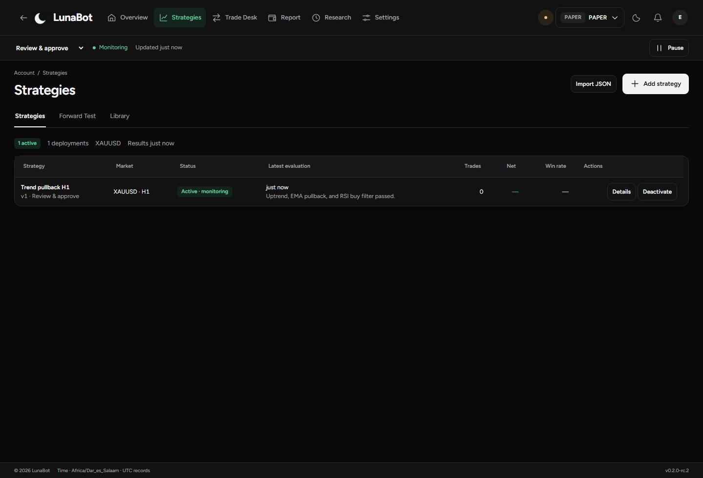
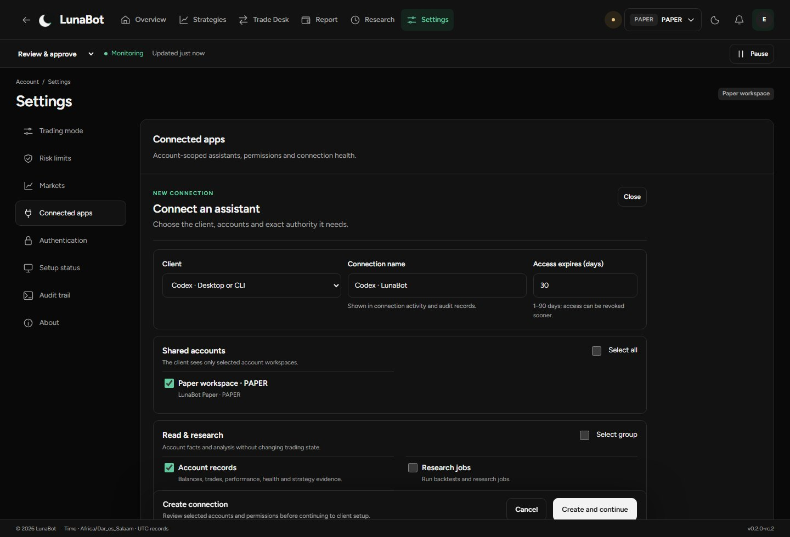
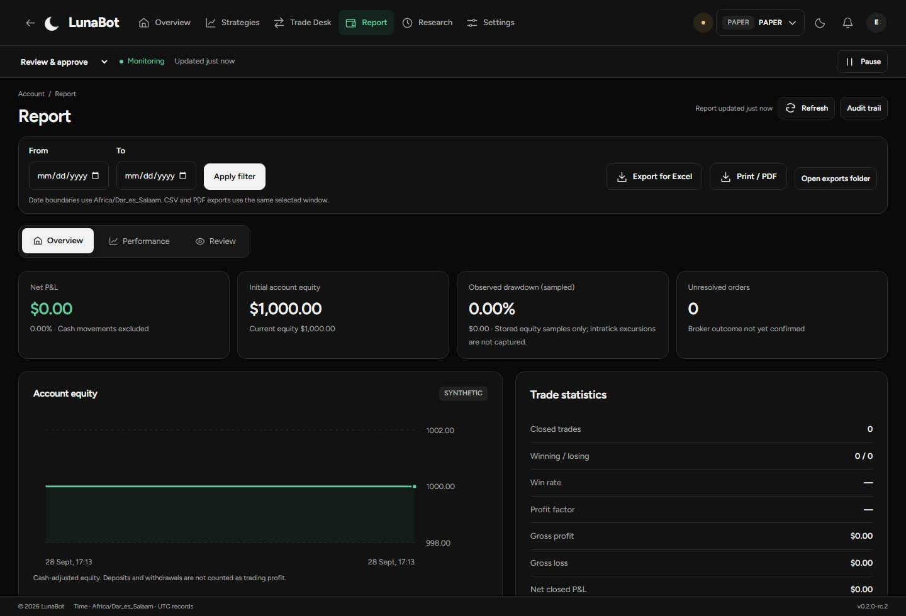

A local Windows trading workstation. Charts, deliberate order preparation, strategy monitoring and permission-scoped assistants.

<a href="https://github.com/EmmanuelMmanda/LunaBot-Desktop/releases/latest"><strong>Download 0.2.1</strong></a> · <a href="https://emmanuelmmanda.github.io/LunaBot-Desktop/">Interactive product tour</a> · <a href="https://emmanuelmmanda.github.io/LunaBot-Desktop/guide.html">Illustrated guide</a> · <a href="docs/START-HERE.md">First run</a>

*Actual interface, disposable Paper profile. All prices and balances are synthetic, not broker performance. Account identifiers removed.*

## One workstation, a complete trading day

Start with account context. Read the market. Prepare an exact order preview. Follow strategy activity and recorded outcomes.

| Workspace | Purpose | See it |
| --- | --- | --- |
| Overview | Account health, exposure and current strategy activity | [Guide](https://emmanuelmmanda.github.io/LunaBot-Desktop/guide.html#overview) |
| Charts | Symbols, timeframes, closed candles and quote freshness | [Guide](https://emmanuelmmanda.github.io/LunaBot-Desktop/guide.html#charts) |
| Trade Desk | Positions, pending orders, proposals and actionable Scouts | [Guide](https://emmanuelmmanda.github.io/LunaBot-Desktop/guide.html#trading) |
| Manual orders | Market/pending terms, protection, exact preview and submission | [Guide](https://emmanuelmmanda.github.io/LunaBot-Desktop/guide.html#manual) |
| Strategies | Versioned rules, market, timeframe and bounded deployment | [Guide](https://emmanuelmmanda.github.io/LunaBot-Desktop/guide.html#strategies) |
| Connected apps | Client selection, scoped permissions and host verification | [Guide](https://emmanuelmmanda.github.io/LunaBot-Desktop/guide.html#connected) |
| Reports | Performance, operational records and supported exports | [Guide](https://emmanuelmmanda.github.io/LunaBot-Desktop/guide.html#reports) |

### A closer look

Overview — account context in light theme

Charts — market context

Strategies — rules and deployment

Connected apps — accounts and permissions

Reports — recorded account outcomes

Every image above uses simulated Paper data. No fabricated returns, live account identifiers or external assistant sessions are presented.

## Install and explore

Windows x64. Download the installer and SHA-256 file from [Releases](https://github.com/EmmanuelMmanda/LunaBot-Desktop/releases/latest), compare the full hash and read the release notes. **The installer is unsigned.** Do not disable Windows security protections.

Choose Paper to learn the interface or MT5 Demo for broker demonstration trading. A separate MT5 terminal is required for broker accounts. Confirm your account, timezone, risk settings and mode before monitoring.

A **one-calendar-month offline trial** begins on first successful launch. After expiry, new exposure is blocked; visibility, records and non-exposure-increasing management remain available. Updating or an ordinary profile reset does not restart the trial.

[Installation](docs/START-HERE.md) · [Complete workstation reference](docs/WORKSTATION-GUIDE.md) · [Activation and updates](https://emmanuelmmanda.github.io/LunaBot-Desktop/guide.html#activation) · [Risk and product limits](docs/PRODUCT-LIMITS.md) · [0.2.1 release notes](docs/RELEASE-0.2.1.md)

## Public materials, private implementation

This repository hosts the product tour, documentation and distributed Windows releases. **The application source is not open source and is not published here.** GitHub-generated source archives contain only these public showcase materials.

LunaBot is an independent developer project, not a profit promise or broker certification. Historical replay and Paper simulations are not evidence of future returns. Read the limits before enabling automation.

## Help

Email [luneya17@gmail.com](mailto:luneya17@gmail.com) or [report a reproducible product issue](https://github.com/EmmanuelMmanda/LunaBot-Desktop/issues). Include version, Windows version and a sanitised screenshot. Send sensitive reports privately; never post credentials, licence tokens, account records or private logs.

Created by Nguli Tz Softwares. **to the mooon 🌙**
