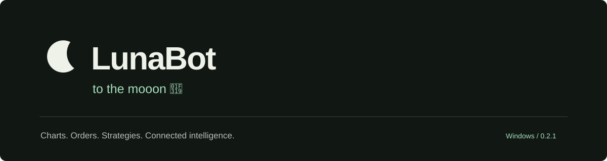
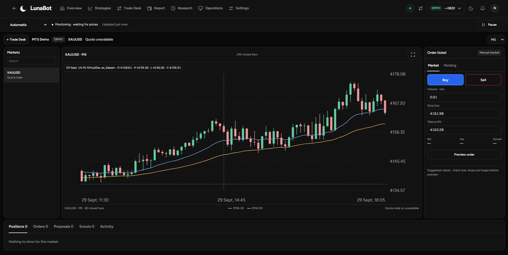

A Windows trading workstation for charts, orders, strategies and connected assistants.

<a href="https://emmanuelmmanda.github.io/LunaBot-Desktop/"><strong>Explore LunaBot</strong></a> · <a href="https://github.com/EmmanuelMmanda/LunaBot-Desktop/releases/latest">Download the latest public release</a> · <a href="https://emmanuelmmanda.github.io/LunaBot-Desktop/guide.html">User guide</a>

*Owner-provided Demo screenshot. The chart shows closed historical candles; its quote was stale or unavailable at capture. It is not a live-price or performance claim.*

## Start with setup

[Install LunaBot](https://emmanuelmmanda.github.io/LunaBot-Desktop/guides/install.html) → [Connect MT5](https://emmanuelmmanda.github.io/LunaBot-Desktop/guides/mt5.html) → [Set up a strategy](https://emmanuelmmanda.github.io/LunaBot-Desktop/guides/strategies.html) → [Check Overview](https://emmanuelmmanda.github.io/LunaBot-Desktop/guides/overview.html)

The illustrated guide follows the app's screens and button names. Each page has section links, previous/next guides and practical steps. The guide works on desktop and phones, with keyboard navigation and Light, Dark or System appearance.

For an MT5 account, onboarding guides you from account type to a dedicated terminal, broker access, identity verification and sync. After installation, LunaBot opens that terminal so you can create or sign in to the broker account; monitoring remains off until you choose to start it.

## Learn LunaBot

| Guide | What you will learn |
| --- | --- |
| [Install & first launch](https://emmanuelmmanda.github.io/LunaBot-Desktop/guides/install.html) | Download LunaBot, choose your appearance and set up your first account. |
| [Connect MT5](https://emmanuelmmanda.github.io/LunaBot-Desktop/guides/mt5.html) | Select the right terminal and connect the exact broker account you intend to use. |
| [Overview & monitoring](https://emmanuelmmanda.github.io/LunaBot-Desktop/guides/overview.html) | Check your account, active strategies and open trades before starting the day. |
| [Charts & markets](https://emmanuelmmanda.github.io/LunaBot-Desktop/guides/charts.html) | Follow the right broker symbols and arrange charts for the way you trade. |
| [Set up strategies](https://emmanuelmmanda.github.io/LunaBot-Desktop/guides/strategies.html) | Choose a strategy, review its settings and decide when it may trade. |
| [Manual trades & orders](https://emmanuelmmanda.github.io/LunaBot-Desktop/guides/trading.html) | Prepare an order, review its exact terms and follow the broker’s response. |
| [Research & backtests](https://emmanuelmmanda.github.io/LunaBot-Desktop/guides/research.html) | Set up a historical test, compare changes and read the results with the settings that produced them. |
| [Trading reports](https://emmanuelmmanda.github.io/LunaBot-Desktop/guides/reports.html) | Review trading results, account activity and unresolved orders, then export the period you need. |
| [Connected apps](https://emmanuelmmanda.github.io/LunaBot-Desktop/guides/connected-apps.html) | Connect an assistant to the accounts and actions you choose. |
| [Operations](https://emmanuelmmanda.github.io/LunaBot-Desktop/guides/operations.html) | Check account setup, connection state, quote freshness and LunaBot-managed computer resources. |
| [Settings, updates & help](https://emmanuelmmanda.github.io/LunaBot-Desktop/guides/settings.html) | Personalise LunaBot and manage account rules, app access and updates. |

## Built-in gold strategies

The library includes H1 Trend pullback and experimental Gold scalp M1/M5. Choose a recipe, review its rules and create an inactive draft. New built-in copies use Review mode; nothing is automatically enabled. Existing deployments keep their settings.

The scalp recipes are intended for Demo engine testing, with spread, news and entry-frequency limits. Profitability is unproven. Review each saved strategy before activation.

## Download and verify

The [latest non-prerelease build](https://github.com/EmmanuelMmanda/LunaBot-Desktop/releases/latest) includes the Windows x64 installer, release manifest and SHA-256 checksums. Compare the full hashes and read the release notes. That build's installer is unsigned.

Choose Paper for local practice or connect an existing MT5 Demo account. Broker accounts require a separate MT5 terminal.

[Release status](https://emmanuelmmanda.github.io/LunaBot-Desktop/releases.html) · [Product limits](docs/PRODUCT-LIMITS.md) · [Image notes](docs/IMAGE-NOTES.md)

The [1.0.1-rc.2 pilot build](https://github.com/EmmanuelMmanda/LunaBot-Desktop/releases/tag/v1.0.1-rc.2) includes the updated Trade Desk and is intended for installed MT5 Demo acceptance. Its installer is locally self-signed and timestamped, **not publicly trusted**; Windows warnings can remain. The enclosed app and engine remain unsigned. It is not production stable, and successful Demo sign-in, two-account isolation and Live behavior are not yet certified. The standard download remains on the published non-prerelease channel; [choose the pilot build explicitly](https://emmanuelmmanda.github.io/LunaBot-Desktop/download.html?channel=pilot).

## About this repository

This repository contains the website, documentation and Windows releases. LunaBot's application source remains private. GitHub-generated source archives contain the public showcase files only.

LunaBot is an independent developer project. Trading involves risk; Paper and backtest results do not promise future returns.

## Support

Prefer a ZIP? [Download the Windows installer ZIP](https://emmanuelmmanda.github.io/LunaBot-Desktop/download.html?format=zip). Extract it, then run the included setup EXE. It contains the same installer and is not a portable build. The release includes a separate ZIP checksum.

Email [luneya17@gmail.com](mailto:luneya17@gmail.com) or [report a product issue](https://github.com/EmmanuelMmanda/LunaBot-Desktop/issues). Include the installed version and steps to reproduce. Remove passwords, account details, licence tokens and private logs before posting.

Created by Nguli Tz Softwares. **to the mooon 🌙**
## AI + LunaBot

Use your compatible assistant to read an account, research a strategy and prepare a trade for review. Start with guided setup and a Demo account.

[Explore MCP and try the interactive examples](https://emmanuelmmanda.github.io/LunaBot-Desktop/mcp.html) · [MCP setup and prompt guide](https://emmanuelmmanda.github.io/LunaBot-Desktop/guides/mcp.html) · [Download the latest Windows installer](https://emmanuelmmanda.github.io/LunaBot-Desktop/download.html)
