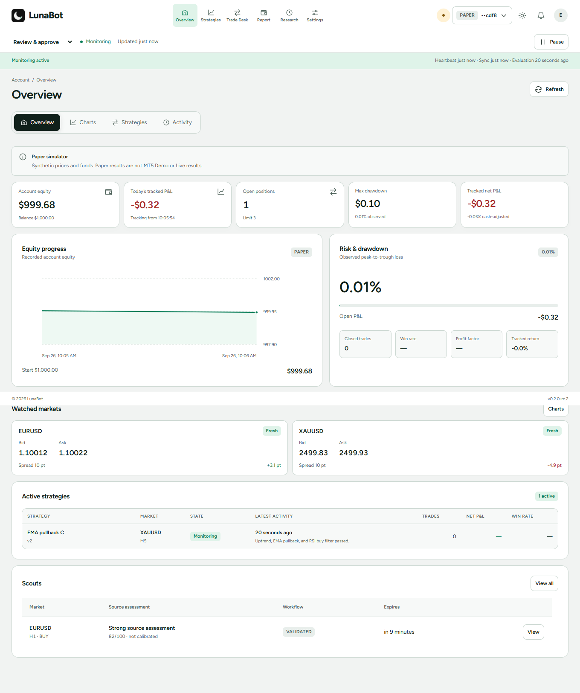

  
  <h1>LunaBot</h1>
  
<strong>to the mooon 🌙</strong>

  
A desktop trading workstation for market analysis, deliberate execution and clear account oversight.

  
<a href="docs/">Explore LunaBot</a> · <a href="docs/WORKSTATION-GUIDE.md">Workstation guide</a> · <a href="docs/START-HERE.md">Install & first run</a> · <a href="https://github.com/EmmanuelMmanda/LunaBot-Desktop/releases">Releases</a> · <a href="mailto:luneya17@gmail.com">Support</a>

*Illustrative interface from a synthetic Paper account. Prices, positions and results shown here are simulated and are not broker performance.*

## A workstation built around the trading day

- Review account health, watched markets, current strategies and recent activity.
- Analyse broker markets and prepare orders with visible risk terms.
- Use versioned strategies, backtests and forward-test records.
- Connect compatible assistants through account-scoped MCP permissions.
- Keep account records and the trading engine on your Windows computer.

LunaBot is an independent desktop project. It does not promise returns or replace a trader's judgement. See [product limits](docs/PRODUCT-LIMITS.md) before connecting a broker account.

## Start here

The Releases page lists published builds, release notes and installer checksums. Read [Start here](docs/START-HERE.md) before installing. A one-calendar-month offline trial begins the first time LunaBot starts on a device. After it ends, activation is needed for new trade exposure; existing account records and position-management tools remain available.

## Learn the workstation

The [workstation guide](docs/WORKSTATION-GUIDE.md) explains the daily flow from account health and market analysis through order review, strategy monitoring, research and exception handling. It describes what each screen is for and what to verify before acting.

| If you want to… | Start here |
| --- | --- |
| Understand the layout and daily workflow | [Workstation guide](docs/WORKSTATION-GUIDE.md) |
| Install and connect a Demo account | [Start here](docs/START-HERE.md) |
| Understand trading, data and automation limits | [Product limits](docs/PRODUCT-LIMITS.md) |
| Inspect the interface | [Interactive product tour](docs/) |
| Download a verified release | [GitHub Releases](https://github.com/EmmanuelMmanda/LunaBot-Desktop/releases) |

## Connected apps

Compatible assistants can connect through MCP after you select the accounts and permissions they may use. Setup is local to your computer; the product-tour connection graphic is an illustration, not a live account link.

## Help

Read [troubleshooting](docs/START-HERE.md#troubleshooting), open an issue for a reproducible product problem, or email [luneya17@gmail.com](mailto:luneya17@gmail.com). Do not post account details, activation tokens, logs containing private information, or credentials in public issues.
